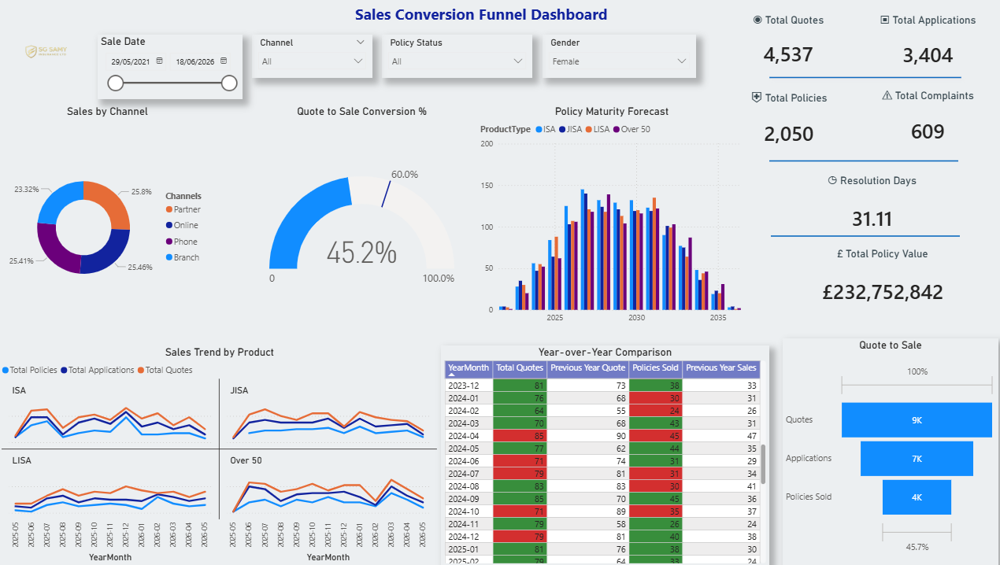

# Sales Conversion Funnel Dashboard – Power BI

## Project Overview

This Power BI dashboard provides an executive-level overview of sales conversion performance for financial products including ISA, JISA, LISA, and Over 50 policies.

The dashboard focuses on quote-to-sale conversion analysis, customer activity monitoring, year-over-year sales comparison, and sales trend analysis across multiple channels to support data-driven business decision-making.

---

## Key Features

- KPI Reporting
- Quote-to-Sale Conversion Funnel
- Policy Maturity Forecasting
- YOY Sales Comparison
- Small Multiples Trend Analysis
- Conditional Formatting
- Dynamic Filtering
- Customer Segmentation

---

## Tools Used

- Power BI Desktop
- DAX
- Power Query
- Excel

---

## Sample DAX Measures

### Quote to Sale Conversion %

```DAX
Quote to Sale Conversion % = 
DIVIDE(
    [Total Policies Sold],
    [Total Quotes]
)
```

### YOY Growth %

```DAX
YOY Sales Growth % = 
DIVIDE(
    [Total Sales] - [Sales LY],
    [Sales LY]
)
```

### Previous Year Sales

```DAX
Previous Year Sales = 
CALCULATE(
    [Total Policies Sold],
    SAMEPERIODLASTYEAR(DateTable[Date])
)

```
## Dashboard Preview



---

## Skills Demonstrated

## Skills Demonstrated

- Power BI Dashboard Development
- DAX & Time Intelligence
- KPI Reporting & Executive Storytelling
- Forecasting & Trend Analysis
- Customer Segmentation
- Financial Services Analytics
- Interactive Data Visualization
- Conditional Formatting & UX Design

---
## Repository Structure

- Dataset/ → Sample dataset used for reporting
- pbix/ → Power BI dashboard file
- Screenshots/ → Dashboard preview images

This project was created as part of my Business Intelligence and Data Analytics portfolio to demonstrate Power BI, DAX, and dashboard storytelling capabilities.

## Author
Satheesh Gurusamy
